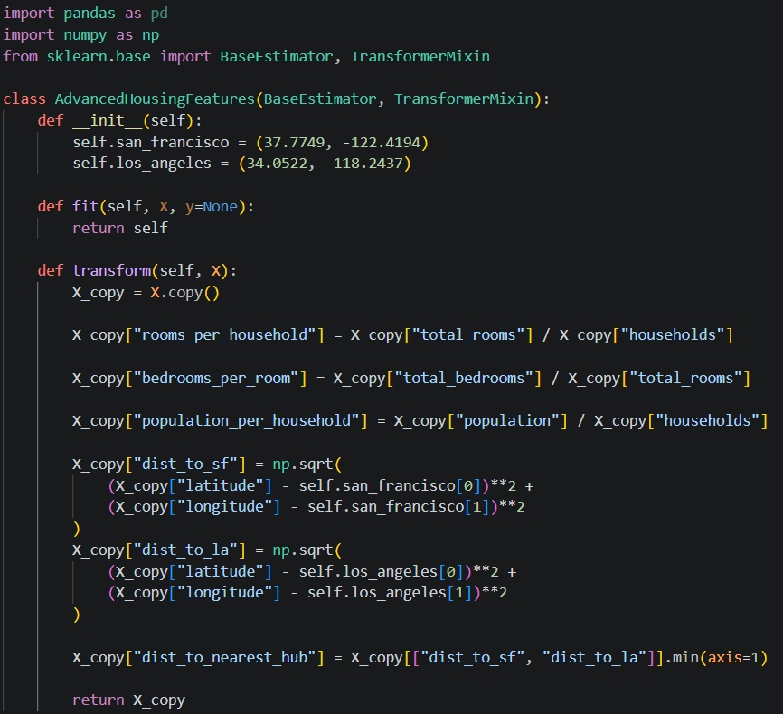
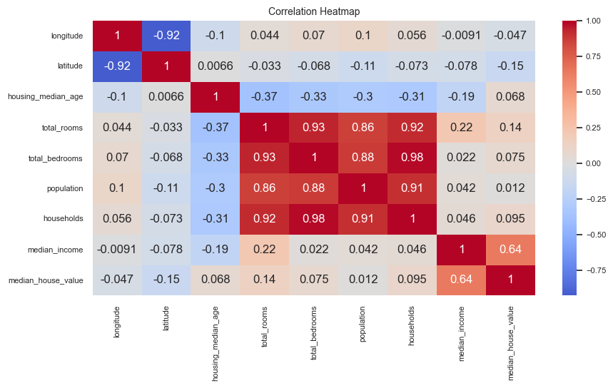
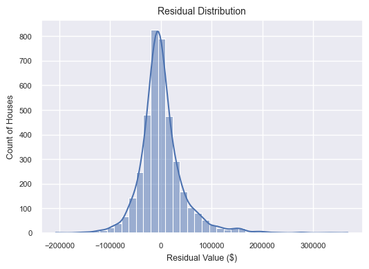

# 🏡 California Housing Price Predictor (End-to-End Tuned LightGBM Pipeline)

A production-grade Machine Learning application deployed via Streamlit that predicts the median house value of neighborhoods in California. This project significantly improves upon standard baseline tutorial models by incorporating target un-biasing, advanced spatial feature engineering, and robust cross-validation tracking.

---

## 🚀 Key Engineering Enhancements (Over the Baseline Tutorial)

Unlike standard implementations that copy basic notebook tutorials, this project introduces major pipeline upgrades:
* **Mitigated Capping Bias:** Audited the dataset to remove artificial target truncation limits (capped at $500,001), preventing decision trees from training on bottlenecked values and reducing model errors.
* **Advanced Spatial Feature Engineering:** Engineered proximity variables calculating the direct distance from each neighborhood block to California's primary economic hubs (San Francisco and Los Angeles).
* **State-of-the-Art Architecture:** Swapped standard boosting models for Microsoft's LightGBM Regressor, utilizing histogram-based binning to maximize training speed and accuracy.
* **Automated Target Scaling:** Integrated a TransformedTargetRegressor wrapper to automatically handle mathematical log-transformations (np.log1p) to fix right-skewed price distributions, reversing it seamlessly during live cloud inference.
* **Robust Spatial Cross-Validation:** Implemented a structural GroupKFold validator based on coordinate blocks to evaluate real-world model generalizability on completely unseen geographic regions.

---

## 🛠️ Complete Pipeline Architecture Execution Flow

The full end-to-end processing pipeline is built completely modularly. Here is the sequential execution flow tracing data from raw ingestion to production-ready deployment model outputs:

### ⚙️ Core Preprocessing & Feature Extraction Steps
Below are the architectural layers handling data scrubbing, custom transformers, and pipeline structuring:

| Stage 01: Preprocessing Core | Stage 02: Structural Split Core | Stage 03: Feature Processing Switching |
| :---: | :---: | :---: |
|  |  |  |

| Stage 04: Engineering Matrix | Stage 05: Pipeline Structure Matrix | Stage 06: Modeling Matrix Core |
| :---: | :---: | :---: |
|  |  |  |

### 📦 Master Deployment Packaging
The final stage abstracts the pipeline into a single tracking wrapper optimized for live low-latency web scaling:

---

## 🔍 Exploratory Data Analysis & Custom Engineering

Before writing feature classes, I mapped out density matrices and coordinate attributes to isolate spatial correlations and target skews.

### Spatial Feature Engineering Logic
To compute precise economic distance anchors, I wrote a custom, object-oriented Scikit-Learn transformer class:

### Feature Correlation Heatmap

---

## 🛠️ The Tech Stack

* **Language:** Python 3.10
* **Environment:** Google Colab (Cloud Architecture)
* **Core Libraries:** Scikit-Learn, LightGBM, Pandas, NumPy, Joblib
* **Deployment:** Streamlit Community Cloud

---

## 📊 Performance Metrics & Validation

The residual distribution curve below confirms that our validation checks are structurally sound—the final LightGBM errors are mathematically unbiased and tightly clustered around zero:

| Evaluation Strategy | Metric Used | Model Performance |
| :--- | :--- | :--- |
| **Random K-Fold CV** | Mean RMSE | $43,210.55 |
| **Spatial Group K-Fold CV** | Mean RMSE | $47,123.80 |
