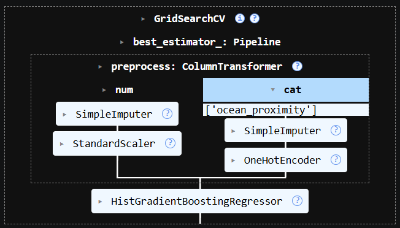
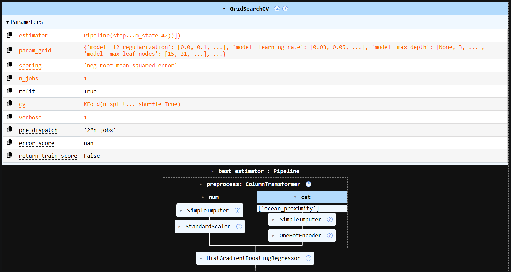
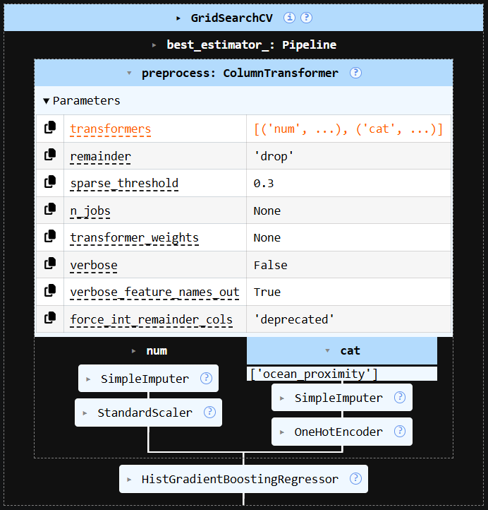
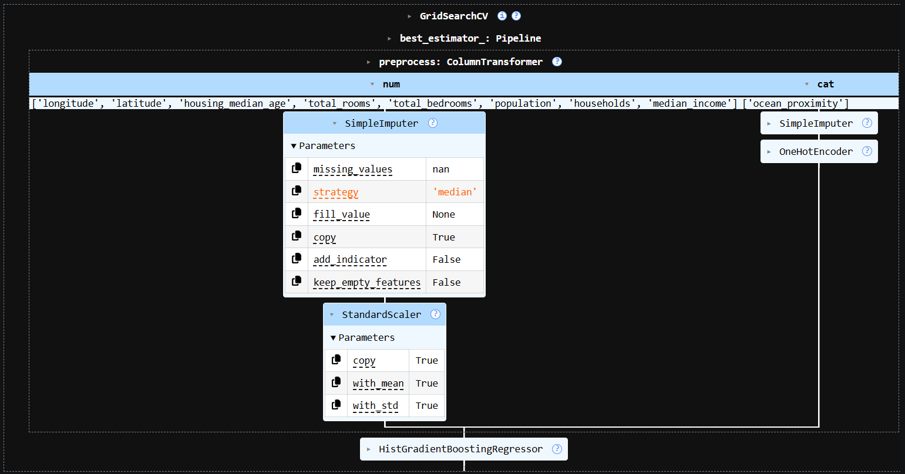
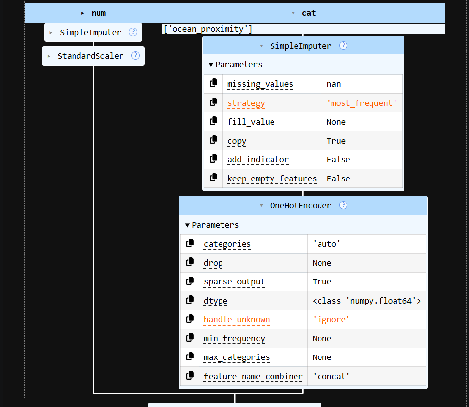
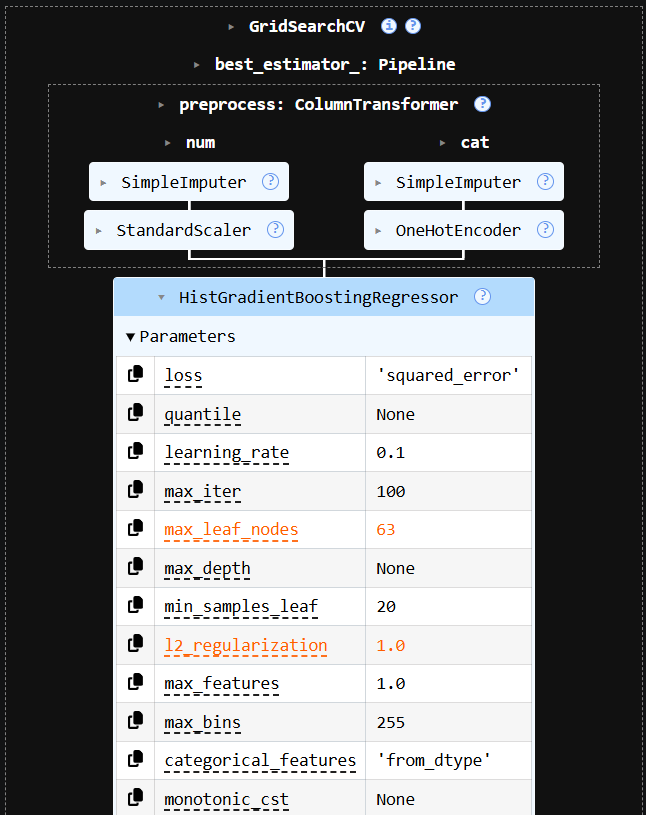
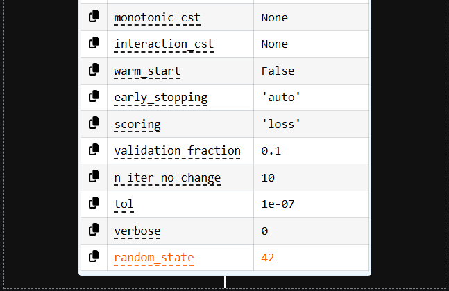

## 🛠️ Complete Pipeline Architecture Execution Flow

The full end-to-end processing pipeline is built completely modularly. Here is the sequential execution flow tracing data from raw ingestion to the final validated model output weights:

### ⚙️ Core Preprocessing & Feature Extraction Steps
Below are the architectural layers handling data scrubbing, custom transformers, and initial pipeline structuring:

| Stage 01: Preprocessing Core | Stage 02: Structural Split Core | Stage 03: Feature Processing Switching |
| :---: | :---: | :---: |
|  |  |  |

| Stage 04: Engineering Matrix | Stage 05: Pipeline Structure Matrix |
| :---: | :---: |
|  |  |

### 📊 HistGradientBoostingRegressor Modeling Core & Packaging
Stages 06 and 07 map out the histogram-based boosting engine configuration and its master integration wrapper, designed for clean, leak-proof training and evaluation:

| Stage 06: HistGradientBoosting Engine | Stage 07: Master Estimator Packaging |
| :---: | :---: |
|  |  |
